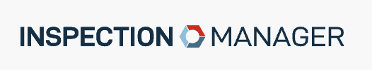

 
# JSON Filter and Export
This project provides a simple web interface to search, filter, and export JSON files. It allows you to search for files based on a keyword, filter the data, and export the filtered data to an Excel file.


## Features

- Search JSON files by keyword
- Filter JSON data based on specific criteria
- Display filtered data in a table
- Export filtered data to an Excel file

## Prerequisites

- Node.js
- npm (Node Package Manager)

## Getting Started

### Step 1: Install Dependencies
To get started, make sure you have Node.js and npm installed on your system. If you don't have them installed, you can download and install them from the official Node.js website.

### Step 2: Clone the Repository
Next, clone the repository to your local machine using the following command:
- When cloning repository, make sure to put the repo in a directory that you can access. Cloning into the desktop directory is recommended.
- Once cloned, cd into the directory where you cloned the repo.
- cd into the repo directory (You can only run this application from inside the repo directory)
```
git clone https://github.com/richardyvarra-st/inspectionmanager-forms-json-filter.git
```
```
cd desktop
cd inspectionmanager-forms-json-filter
```

### Step 3: Install Packages
Navigate to the project directory and install the required packages by running the following command:

```
npm install
```

### Step 4: Start the Application
Once the packages are installed, you can start the application by running the following command:

```
npm run start
```

### Step 5: Access the Web Interface
Open your web browser and navigate to `http://localhost:3000` to access the web interface.

### Suggestion 
VS Code is recommended for running this application, you can download the app via ServiceTrade Self-Service application.

This project provides a simple web interface to search, filter, and export JSON files. It allows you to search for files based on a keyword, filter the data, and export the filtered data to an Excel file.

## Features

- Search JSON files by keyword
- Filter JSON data based on specific criteria
- Display filtered data in a table
- Export filtered data to an Excel file

## Prerequisites

- Node.js
- npm (Node Package Manager)

## Getting Started
To write subsections for the "Getting Started" section, you can use the following markdown format:

### Step 1: Install Dependencies
To get started, make sure you have Node.js and npm installed on your system. If you don't have them installed, you can download and install them from the official Node.js website.

### Step 2: Clone the Repository
Next, clone the repository to your local machine using the following command:

```
git clone https://github.com/richardyvarra-st/inspectionmanager-forms-json-filter.git
```

### Step 3: Install Packages
Navigate to the project directory and install the required packages by running the following command:

```
npm install
```

### Step 4: Start the Application
Once the packages are installed, you can start the application by running the following command:

```
npm run start
```

### Step 5: Access the Web Interface
Open your web browser and navigate to `http://localhost:3000` to access the web interface.


### Suggestion 
VS Code is recommended for running this application, you can download the app via ServiceTrade Self-Service application.

### Technology:
- 

- 

- 

- 

- 

- 


